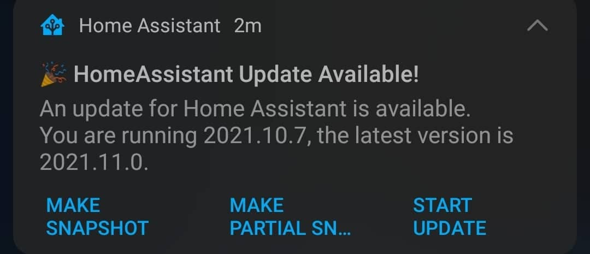

# Example alert

# Workflow explained

This folder contains an example of how to set up alerts for Homeassistant updates and actions to trigger services.
In this case you can choose to make a partial or full backup before updating or just start the upgrade.
If you choose to do the backup first then the notification will disapear after pushing the button.
When the snapshot is complete you'll get a new notification with the option to start the update.

Remember to change the service-name for mobile_app in these files as the name is unique to your mobile.

So change this: `service: notify.mobile_app_YOUR_MOBILE_HERE` in the following files:

- `mobile_alert_for_ha_updates/automations/system/homeassistant_new_release.yaml`
- `mobile_alert_for_ha_updates/automations/system/supervisor_new_snapshot_alert.yaml`
